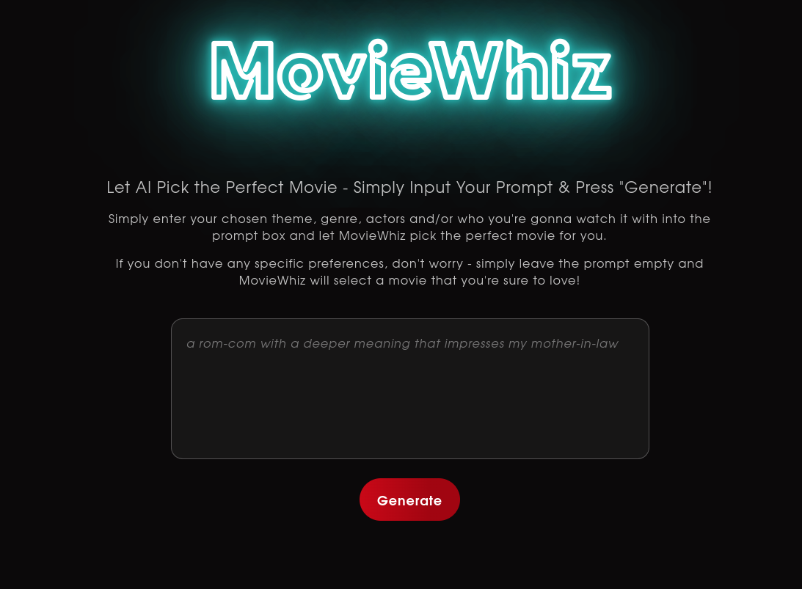
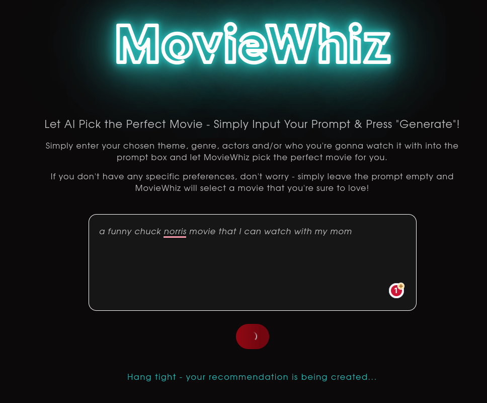
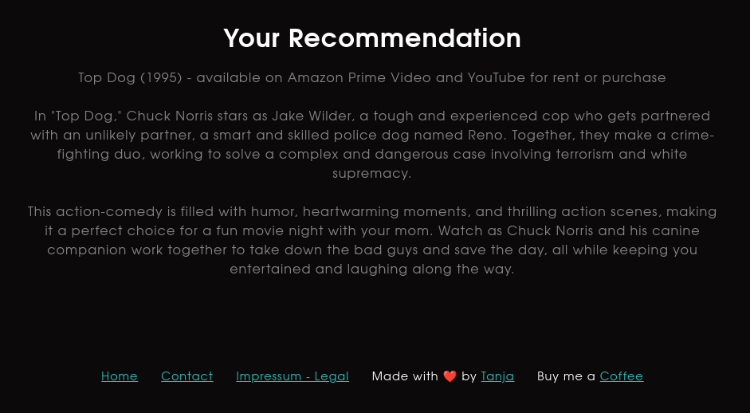

# MovieWhiz

MovieWhiz is an AI-powered web application that provides movie recommendations based on user input. The app utilizes OpenAI to generate movie suggestions tailored to the user's specific preferences, making it an essential tool for movie lovers.

You can use MovieWhiz without sign-up or login. Simply visit [moviewhiz.xyz](https://moviewhiz.xyz/) and start generating movie recommendations!


*MovieWhiz - Homepage*


*Generating Movie Recommendation*


*Movie Recommendation*

## Table of Contents
- [Features](#features)
- [Getting Started](#getting-started)
- [Prerequisites](#prerequisites)
- [Installation](#installation)
- [Usage](#usage)
- [Understanding the Code](#understanding-the-code)
- [Resources](#resources)
- [Contributing](#contributing)
- [License](#license)
- [Support](#support)

## Features
- GPT-4-powered AI movie recommendations
- Customizable prompts for personalized suggestions
- Simple and intuitive user interface
- Built with Next.js and OpenAI API

## Getting Started
Follow these steps to set up MovieWhiz on your local machine.

### Prerequisites
1. Before getting started, make sure you have the following software installed on your system:

   - [Node.js](https://nodejs.org/en/) (version 14.x or later)

   This project was built using Node.js v18.14.0. If you use [NVM](https://github.com/nvm-sh/nvm), you can run `nvm use` to switch to this version.

2. You also need OpenAI's API key with access to the chat endpoint. 
   - You can get an API key by signing up for an OpenAI account [here](https://beta.openai.com/).
   - This project currently uses GPT-4.
   - You can downgrade to GPT-3.5-turbo by changing the `model` parameter for each request in `pages/api/generate.js`.
   - Older models are available [here](https://beta.openai.com/docs/developer-quickstart/api-reference/models). These use a different API endpoint - you will need to update the code in `pages/api/generate.js` and potentially in `pages/index.js`.

### Installation
1. [Fork](https://docs.github.com/en/get-started/quickstart/fork-a-repo) and then clone this repository:
   ```
   git clone https://github.com/<your username>/moviewhiz.git
   ```

2. Move into the project directory:
   ```
   cd moviewhiz
   ```

3. Install the required packages:
   ```
   npm ci 
   ```

4. Create a `.env` file in the root directory to store your OpenAI API key:

   ```
   touch .env
   ```

5. Open the file with your preferred text editor and add the following line, replacing `your_api_key` with your actual OpenAI API key:

   ```
   OPENAI_API_KEY=your_api_key
   ```
   **Important**: Do not commit your API key to the repository. Make sure that `.env` is added to your `.gitignore` file - if it's not present, add it before staging files. You are responsible for keeping your API key secure! 


6. Start the development server:

   ```
   npm run dev
   ```

7. Open your browser and navigate to `http://localhost:3000` to view the application.

## Usage
Using MovieWhiz is simple and straightforward. Simply type your movie preferences into the prompt box, such as theme, genre, actors, your current mood, or who you're watching with, and click the "Generate" button.

If you don't have any specific preferences, you can leave the prompt empty, and MovieWhiz will still provide a movie recommendation.

The AI will process your input and generate a movie recommendation tailored to your preferences. Your recommended movie will be displayed in the "Your Recommendation" section.

## Understanding the Code

This section will provide a brief explanation of the code in the `index.js` file to help you understand how MovieWhiz functions.

### Importing Components and Hooks

At the beginning of the file, we import the necessary components and hooks from Next.js, React, and our custom components:

```javascript
import Head from 'next/head';
import Footer from '../components/Footer';
import GenerateButton from '../components/GenerateButton';
import LoadingMessage from '../components/LoadingMessage';
import { useState } from 'react';
```

### The Home Function Component

The `Home` function component serves as the main component for our application, containing the state and logic for handling user input and generating movie recommendations.

```javascript
const Home = () => {
  // State variables
  const [userInput, setUserInput] = useState('');
  const [apiOutput, setApiOutput] = useState('');
  const [isGenerating, setIsGenerating] = useState(false);

  // Function for calling the API
  const callGenerateEndpoint = async () => {
    // ... (API call and response handling)
  };

  // JSX return
  return (
    // ... (JSX content)
  );
};
```

### State Variables

We use three state variables to manage the user input, API output, and loading state:

- `userInput`: Stores the user's input from the prompt box.
- `apiOutput`: Stores the movie recommendation generated by the API.
- `isGenerating`: A boolean flag to indicate if the app is currently generating a movie recommendation.

### The callGenerateEndpoint Function

This async function is responsible for making the API call to the `/api/generate` endpoint with the user's input and handling the response. It sets the `isGenerating` state to `true` when the API call is initiated and updates the `apiOutput` state with the generated movie recommendation or an error message if the call fails.

```javascript
const callGenerateEndpoint = async () => {
  setIsGenerating(true);

  console.log("Calling OpenAI...");
  const response = await fetch('/api/generate', {
    method: 'POST',
    headers: {
      'Content-Type': 'application/json',
    },
    body: JSON.stringify({ userInput }),
  });

  if (response.ok) {
    const data = await response.json();
    const { output } = data;
    console.log("OpenAI replied...", output);

    setApiOutput(`${output}`);
  } else {
    const errorData = await response.json();
    console.error("Error from the server:", errorData);
    setApiOutput("An error occurred. Please try again.");
  }
  setIsGenerating(false);
};
```

### JSX Return

The `return` statement contains the JSX code that renders the main structure of the application, including the header, prompt box, generate button, and output section.

The `GenerateButton` component is passed the `isGenerating` state and the `callGenerateEndpoint` function as props, which are used to control the button's behavior and appearance.

Conditional rendering is used to display the `LoadingMessage` component while the app is generating a movie recommendation, and the `apiOutput` state is used to display the recommendation or error message once the process is complete.

```javascript
return (
  <div>
    // ... (Head and title)
    <div className="container">
      // ... (Header and subtitle)
      <div className="prompt-container">
        // ... (Prompt box for user input)
      </div>
      <div className="prompt-buttons">
        <GenerateButton
          isGenerating={isGenerating}
          onClick={callGenerateEndpoint}
        />
      </div>
      {isGenerating ? (
        <LoadingMessage />
      ) : (
        apiOutput && (
          <div className="output">
            // ... (Output header and content)
          </div>
        )
      )}
    </div>
    <Footer />
  </div>
);
```

This should provide a basic understanding of the code structure and functionality in the `index.js` file. For more details, you can explore the custom components and API routes in the repository.


## Resources
- [OpenAI API](https://beta.openai.com/docs/api-reference/introduction)
- [MovieWhiz](https://moviewhiz.xyz/) - the live version of this project
## Contributing
Contributions are always welcome! If you'd like to contribute to this project or have any suggestions, feel free to create a new issue or submit a pull request. Please check the [Code of Conduct](./CODE_OF_CONDUCT.md) first.

To submit a pull request, follow these steps:
1. Fork the repository
2. Create your feature branch (`git checkout -b feature/your-feature-name`)
3. Commit your changes (`git commit -am 'Add some feature'`)
4. Push to the branch (`git push origin feature/your-feature-name`)
5. Create a new Pull Request

## License

This project is open-source and available under the [MIT License](./LICENSE.md).

## Support
If you have any questions or need help getting started, please open an issue in the repository or contact me on Twitter: @tanja_codes

Happy movie hunting!